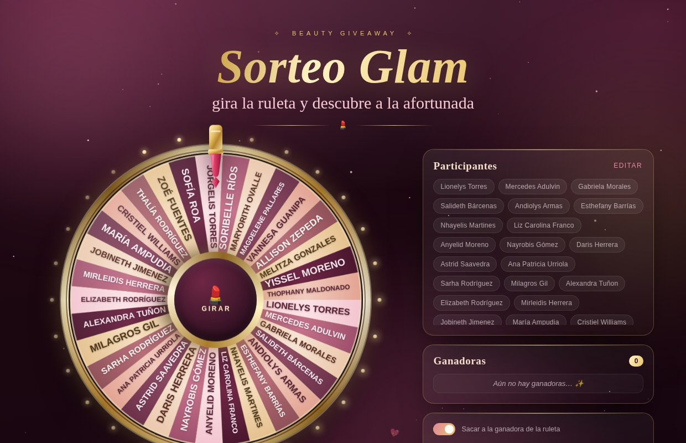

# 💄 Sorteo Glam · Ruleta de Maquillaje

Ruleta de sorteo con temática de maquillaje: oro rosa, vino, nude y mucho brillo.
Todo funciona en el navegador, sin dependencias ni servidor.



## ✨ Qué incluye

- **Ruleta animada** dibujada en canvas, con gajos en tonos de labial, aro dorado y focos tipo espejo de camerino.
- **Puntero labial** que "tiquea" con cada nombre que pasa.
- **Giro realista**: 6–8 vueltas con desaceleración suave (~7 s) y sonido generado en el navegador.
- **Modal de ganadora** con confeti de labiales, besos, coronas y brillos.
- **Historial de ganadoras** y opción de sacar a la ganadora de la ruleta para sortear varios premios.
- **Lista editable** desde la misma página (botón *editar*), con la selección guardada en el navegador.
- Responsive, con animaciones de entrada, brillos flotantes y respeto por `prefers-reduced-motion`.

## 🚀 Cómo usarlo

Abre `index.html` en cualquier navegador. Nada más.

Para publicarlo en internet: **Settings → Pages → Deploy from a branch → `main` / `root`**.
En un par de minutos queda en `https://<usuario>.github.io/sorteo-ruleta-glam/`.

## 👑 Cambiar las participantes

Dos formas:

1. **Desde la página**: botón *editar* en el panel de participantes, un nombre por línea.
2. **En el código**: edita el arreglo de `js/participantes.js`.

```js
window.PARTICIPANTES = [
  "Nombre Apellido",
  "Otro Nombre",
];
```

Los nombres repetidos se ignoran automáticamente al cargar.

## ⌨️ Atajos

| Tecla | Acción |
| --- | --- |
| `Espacio` | Girar la ruleta |
| `Esc` | Cerrar el anuncio de la ganadora |

## 🧾 Notas

- El sorteo es aleatorio uniforme (`Math.random()`) sobre las participantes que siguen en la ruleta.
- El progreso (ganadoras y quién sigue en juego) se guarda en `localStorage`, así que puedes recargar sin perder el sorteo. El botón **Reiniciar sorteo** lo devuelve todo al inicio.

## 📁 Estructura

```
index.html            estructura de la página
css/styles.css        estilos, paleta y animaciones
js/participantes.js   lista de participantes
js/app.js             ruleta, giro, sonido, confeti y panel
```
