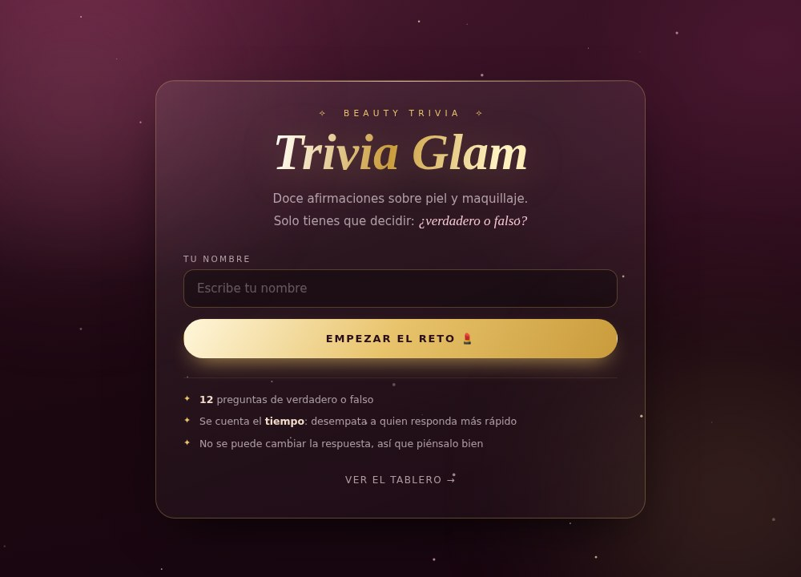

# 💋 Trivia Glam · Reto de Maquillaje

Trivia de verdadero o falso sobre piel y maquillaje. Cada participante escribe su nombre,
responde 12 preguntas contrarreloj y obtiene un resultado con un **código** para entrar al **Top 10**.

Funciona en el navegador, sin dependencias ni servidor.



## ✨ Cómo funciona

1. La participante entra, escribe su nombre y responde las 12 afirmaciones.
   Después de cada respuesta ve si acertó y **por qué** es esa la respuesta.
2. Al terminar obtiene sus aciertos, su tiempo y un **código de resultado**
   (`GLAM-…`). El botón *Copiar para el grupo* deja listo el mensaje para pegar en WhatsApp.
3. Quien organiza abre el **tablero**, pega los códigos que le mandan —puede pegar
   la conversación entera, los códigos se detectan solos— y el Top 10 se arma solo.

### ¿Por qué códigos y no un tablero en vivo?

Es una página estática: no hay servidor donde guardar los resultados de todas, así que
no pueden sincronizarse solos entre teléfonos. El código lleva dentro el nombre, los
aciertos y el tiempo, más un dígito de control que descarta los códigos mal copiados.

## 🏆 Reglas del Top 10

Se ordena por **aciertos** y, en caso de empate, por **tiempo**. Si alguien juega
varias veces solo cuenta su mejor intento. El tablero se guarda en el navegador
de quien organiza (`localStorage`).

## ✏️ Cambiar las preguntas

Edita `js/preguntas.js`:

```js
{
  texto: "La piel grasa necesita hidratación.",
  respuesta: true,          // true = la afirmación es verdadera
  porque: "Se muestra después de contestar."
}
```

Puedes poner las que quieras: el marcador y el Top 10 se ajustan solos al número de preguntas.
Los nombres sugeridos al escribir vienen de `js/participantes.js`, pero cualquiera puede jugar
aunque no esté en la lista.

## 🚀 Publicar

Abre `index.html` en cualquier navegador. Para tenerlo en internet:
**Settings → Pages → Deploy from a branch → `main` / `root`**.

`node build-single.js` genera una versión con todo en un solo archivo HTML,
por si prefieres mandarla suelta.

## 📁 Estructura

```
index.html            las cuatro pantallas: inicio, preguntas, resultado y tablero
css/styles.css        estilos, paleta y animaciones
js/preguntas.js       las preguntas y sus explicaciones
js/participantes.js   nombres sugeridos
js/app.js             lógica del reto, códigos de resultado y tablero
build-single.js       genera la versión de un solo archivo
```
